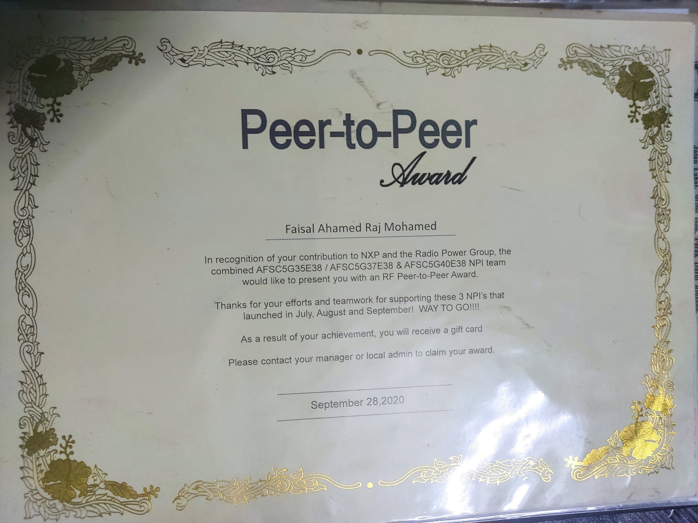
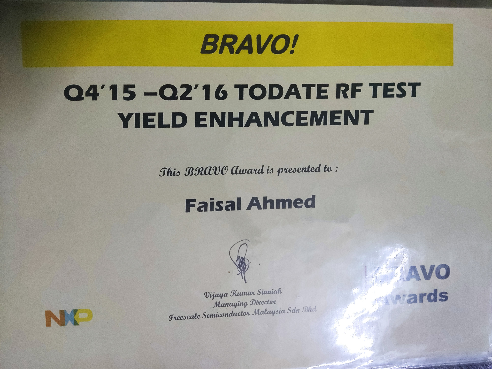

<h1 align="center">Faisal Ahamed – Senior Principal Test Development Engineer</h1>

  
  

---

### About Me

Experienced engineer with 15+ years in **Test Development** and **Product Engineering** in the semiconductor industry. Proven track record in **RF characterization**, **load board design**, and **new product introduction (NPI)**. Certified Six Sigma Green & Black Belt.

---
### Work Experience

NXP Malaysia Sdn Bhd Petaling Jaya, SGR, Malaysia
Staff Black Belt Product Engineer January 2016 - March 2024

- Architected dc load board design for NTI package OM4008, LGA(4x4.5mm, 6x7.5mm, 7x10mm), PQFN(8x8mm) which
enabled 100% conversion to new 20 Juno testers without business disconnect in 2019 and honored with multiple TEA awards.|
• Led a diverse team of 5 specialists across Leaded, BGA, RF, Sensor, and Quality; formed a plantwide DMAIC team that
excelled in reducing customer quality complaints by 50% in 2018, garnering several accolades.
• Coordinated a multi-functional team from engineering, design, manufacturing, and quality assurance for Macro GAN NPI in
SOE package, achieving $200M in lifetime revenue in 2019 with highest ASP in new Gan 4.5 technology.
• Spearheaded NTI/NPI product in 7x10mm DMS module GAN in 2020 which translated to USD 100 million in sales and
enabled 10 testers duplicated for increased run rates.
• Engineered the first PLD package from Cassini platform to NI platform in 2021 to increase capacity by reducing test time by
25%.
• Launched state of the art NTI (New Technology Introduction) top cooling heatsink package Triseca(14x10mm) and secured
socket win of USD 68 million in 2019.
• Championed test program development and DC hardware readiness for state of the art NTI 20x16mm mid-power module
which translated to USD 120 million revenue in 2024.
• Introduced more than 50 NPIs with high gross margins and significantly contributed to company revenue growth from 2000
to 2024.
• Facilitated customer quality incident on Silicon Germanium digital product line by engaging business group in which the
product launched with quality fix to memory read/write error with sales of 2 million parts with USD 40 million revenue from
January 2022 to December 2023.

Freescale Semiconductor Malaysia Sdn Bhd Petaling Jaya, SGR, Malaysia
Staff Product Engineer January 2004 - December 2015

• Resolved customer oscillation complaint on MW4IC2230 and sustained business continuity worth of USD 40 million in 2005
using ADS software and clinched Bronze Medal
• Integrated load board arrangements for MW6IC2240/MW6IC2015 business opportunity of USD 23 Million in 2005 achieved
silver medal at plantwide forum
• Implemented DC Check Open/Short at RF tester using sift HTBASIC codes in 2006 to prevent burnt circuits reduced downtime
from 2 shifts to nil and secured Bronze Medal
• Innovated RF test time reduction method in 2006 and increased throughput by 2x per shift and en rooted Bronze Medal
• Studied M52A die mask Series Capacitance Nitride Thickness to RF Performance joint collabration characterization with
wafer fab in 2008 and elevated product yield to 99% and reached Bronze Medal
• Eliminated Ruptured DC leaking prevention Cap Escape to Customer-MD7IC2050N in 2010 initiated Bronze Medal and
successfully found a unique method of grounding the RF pin and disabled escapee
• Characterized mask L15 Yield Improvement (Black belt Project) through innovative Direct Current load board routing using
statistical approach in 2011 and drafted Bronze Medal and demonstrated significant cost saving of USD 250K per annum
• Developed MD7IC2050 pristine DC Board with 4 Point Kelvin System in 2011 and listed Silver Medal by improving VDs on
accuracy by 50% through innovative force and sense design principle
• Overhauled MR6VP3091 symmetrical lead shorting test Escapee to Customer by successfully recalibrated DC load board
structure and accompanied by software changes to detect shorted leads through innovative test program in 2011 securing
distinguished Bronze Medal
• Executed Gross Margin improvement for RFIC Platform in 2013, capturing Bronze Medal for elevating test yield from 94%
to 99% by eradicating ESD issues, achieving annual cost savings of $400K.

Motorola Malaysia Sdn Bhd Petaling Jaya, SGR, Malaysia
Senior Product Engineer January 2000 - December 2003

• Enhanced test capability for HPA (High Power Amplifier) by developing in-line tuning using 3 equipment namely network
analyzer, spectrum, and signal generator with lifetime revenue of USD 200 million which conferred Bronze Medal in 2003.
• Revamped the PA MHPA18010, boosting capability enhancement quality index from 0.5 to 1.67, facilitating device
qualification with $250 million revenue, and securing a green belt DMADV project certification for exceptional statistical
methodology in 2004.

### Certifications & Awards

|  |  |
|-------------------------------|-------------------------------|
!|  |  |
!|  |  |

!> Add or rename images as needed in the `assets/` folder. Use `.jpg` or `.png` format.

---

### Contact

- **Email**: faisal.engineer2025@gmail.com  
- **LinkedIn**: [linkedin.com/in/faisal-ahamed](https://www.linkedin.com/in/faisal-ahamed)  
- **Location**: Kuala Lumpur, Malaysia

---

### Note

To update this page:
1. Place your `Resume_Cert.pdf` and plague images in the `assets/` folder.
2. Use correct file names in the image links above.
3. Commit changes to GitHub and refresh the page.
